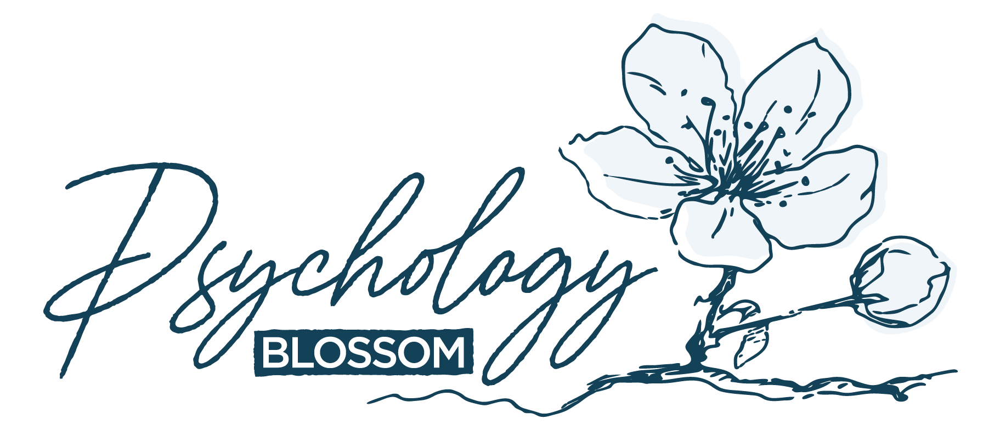

# Psychology Blossom Chatbot
Chatbot Project built for Psychology Blossom, a Singapore-based counselling service

### Access the Project on Streamlit:

  

If you'd like to request access, please reach out to [AsJayTee](https://github.com/AsJayTee) on GitHub.  

## Running the Code
- **Configure Environment**: Copy ``.env.example`` and set up necessary environment variables
- **Install Dependencies**: Run `pip install -r requirements.txt`
- **Activate Demo Interface**: Run `streamlit run demo.py`

## App details
Currently, the chatbot supports a modified, structured RAG architecture. It also displays the running cost of the chatbot. There are future plans to integrate an automated appointment-making system.

