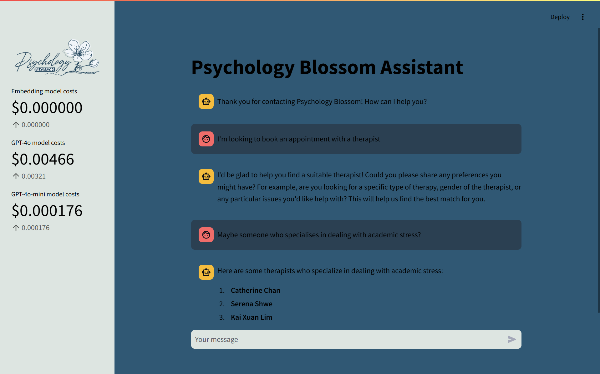

# Psychology Blossom Chatbot


A powerful chatbot platform designed for **Psychology Blossom**, a Singapore-based counselling service. This chatbot helps clients find suitable therapists based on their preferences and answers frequently asked questions about the services offered.

---

## 🗝️ Key Features

### ⚙️ Optimized Retrieval-Augmented Generation (RAG) System
Our chatbot employs a **custom RAG architecture** that optimizes for both accuracy and cost-efficiency:

- **Smart Query Handling**: Reformulates questions into more precise queries while adding context from conversation history.
- **Efficient Embedding**: Unlike traditional RAG systems that embed entire document chunks, this architecture only embeds the questions, significantly reducing token usage.
- **Semantic Similarity Search**: Retrieves content based on similarity scores between the customer's query and pre-indexed questions.
- **Context Isolation**: Separates questions from answers in embeddings to avoid answer-skewed vector representations.
- **Direct Q&A Mapping**: Each embedded question maps directly to a corresponding answer, ensuring precise results.

This design enhances retrieval precision while keeping operational costs low.

### 🧠 Intelligent Therapist Matching
System implements a **robust filtering mechanism** to match clients with therapists:

- **Multi-factor Filtering**: Matches therapists based on:
  - Gender preferences
  - Language requirements
  - Specializations (anxiety, depression, etc.)
  - Target patient age groups (adults, children and teens)
  - Price range preferences
  - Appointment availability
- **Persistent Preference Memory**: The `Preferences` class maintains the client's stated preferences across the entire conversation, eliminating reliance on the LLM's conversational memory
- **Set-based Operations**: Uses efficient set intersections to narrow down suitable therapists based on accumulated preferences
- **Fuzzy Matching**: Implements Levenshtein distance calculation to handle slight misspellings or variations in preference statements

This preference system provides reliable recommendations without the risk of preference hallucination or misremembering that can occur with standard LLM-based memory.

### 🔧 Tool-Driven Reliability
Our chatbot operates through a robust **tool-calling system** designed for reliability:

- **Minimal Argument Dependency**: Most tools operate without arguments or parameters, instead accessing conversation context directly
- **Hardcoded Operations**: Core functionality is implemented in dedicated Python classes rather than relying on LLM reasoning

This structured approach significantly reduces the opportunity for errors, especially for complex preferences that can be **relative (e.g., “more expensive”)** or **absolute (e.g., “a therapist who speaks Mandarin”)**.

### 💲 Cost Monitoring & Optimization
- **Real-Time Cost Tracking**: Monitors token usage for embeddings and responses.
- **Model Tiering Strategy**:  Strategically uses different OpenAI models (**GPT-4o for user interactions** and **GPT-4o-mini for internal tasks**) to balance performance and cost.
- **Transparent Cost Reporting**: Displays real-time operational expenses in the UI.

---

## Future Development
- **Integration with appointment scheduling systems**
- **Expansion of the therapist database**
- **Enhanced filtering criteria for more personalized recommendations**

---

## Getting Started

### Installation
1. Clone the repository:
   ```sh
   git clone https://github.com/your-repo/psychology-blossom-chatbot.git
   ```
2. Copy `.env.example` to `.env` and add your OpenAI API key.
3. Install dependencies:
   ```sh
   pip install -r requirements.txt
   ```
4. Run the chatbot interface:
   ```sh
   streamlit run demo.py
   ```

### Demo Interface
The chatbot features an intuitive **Streamlit web interface**:



### Try It Online
Experience the chatbot in action on Streamlit:

[](https://pb-chatbot-demo.streamlit.app)

For access requests, please contact [AsJayTee](https://github.com/AsJayTee) on GitHub.

## Contact
For more information about **Psychology Blossom**:
- 🌐 **Website**: [psychologyblossom.com](https://psychologyblossom.com/)
- 📧 **Email**: hello@psychologyblossom.com
- 📞 **Phone**: +65 8686 8592

